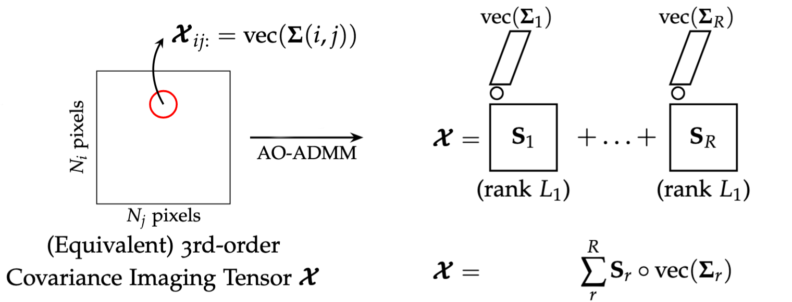

.. pyBBTD documentation master file, created by
   sphinx-quickstart on Tue Sep  2 12:16:27 2025.
   You can adapt this file completely to your liking, but it should at least
   contain the root `toctree` directive.

pyBBTD docs
====================
**pyBBTD** is a Python library that implements two tensor decomposition models: **Cov-LL1** and **BBTD**.

The **Cov-LL1** model is a third-order tensor decomposition method designed for *covariance imaging tensors* — that is, tensors in which each pixel carries a covariance matrix. The rank-1 term (vector) in each block corresponds to a vectorized covariance matrix.

In mathematical form, Cov-LL1 decomposes a third-order tensor :math:`\mathcal{X}` as:

.. math::

   \mathcal{X} \approx \sum_{r=1}^{R} \mathbf{A}_r \mathbf{B}_r^{\top} \circ \mathbf{c}_r

where:

- :math:`R` is the number of components.

- :math:`\mathbf{A}_r \in \mathbb{R}^{I \times L_1}` and :math:`\mathbf{B}_r \in \mathbb{R}^{J \times L_1}` represent spatial factor matrices of rank :math:`L_1`, and  

- :math:`\mathbf{c}_r \in \mathbb{R}^{K^2}` is a vectorized :math:`K \times K` covariance matrix associated with the :math:`r`-th component.

The parameters :math:`R` (number of components) and :math:`L_1` (spatial rank) can be adjusted by the user, as illustrated in the figure below.

**BBTD** is a fourth-order tensor decomposition model that represents a tensor as a sum of two blocks.  
Unlike **Cov-LL1**, the **BBTD** model allows the user to set not only the number of blocks :math:`R` and the spatial rank :math:`L_1`, but also the covariance rank :math:`L_2` for the covariance matrices in each block.
In mathematical form, **BBTD** decomposes a fourth-order tensor :math:`\mathcal{T}` as:

.. math::

   \mathcal{T} \approx \sum_{r=1}^{R} \mathbf{A}_r \mathbf{B}_r^{\top} \circ \mathbf{C}_r\mathbf{C}_r^{H}

where:

- :math:`R` is the number of components.

- :math:`\mathbf{A}_r \in \mathbb{R}^{I \times L_1}` and :math:`\mathbf{B}_r \in \mathbb{R}^{J \times L_1}` represent spatial factor matrices of rank :math:`L_1`, and  

- :math:`\mathbf{C}_r\mathbf{C}_r^{H} \in \mathbb{C}^{K \times K}` is the covariance matrix of the :math:`r`-th component, with each :math:`\mathbf{C}_r \in \mathbb{C}^{K \times L_2}`

The figure below illustrates the structure of the **BBTD** model.

.. image:: index_files/model_bbtd.png
.. toctree::
   :maxdepth: 2

   tutorials/index
   reference

Planned releases
====================

- **4th-order model (BBTD)**: planned for early-November 2025
