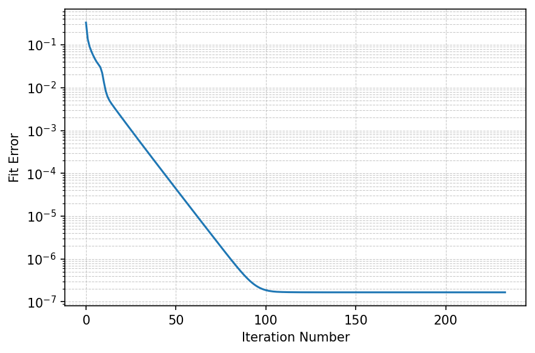

BBTD tutorial (Constrained ADMM)
===================================

This tutorial provides an introduction to the constrained Block-Block Terms Decomposition (BBTD) for covariance imaging using the AO-ADMM solver. The constraints enforce non-negative spatial maps and conjugate symmetry.

Load required libraries
------------------------

.. code:: python3

    import pybbtd.bbtd as bbtd
    from pybbtd.uniqueness import check_uniqueness_BBTD
    import numpy as np
    from pybbtd.visualization import draw_metrics

Define the BBTD model
-----------------------------------------------------

We define a 4D tensor with shape (J, M, K, K), where the last two dimensions correspond to the covariance structure.

.. code:: python3

    np.random.seed(0)

    # Define tensor size and BBTD parameters
    J, M, K = 20, 25, 4  # spatial dims (J, M) and covariance dim K
    R = 3  # number of BBTD terms
    L1 = 3  # rank of the first block (A, B)
    L2 = 2  # rank of the second block (C, D)

    # The 4D tensor has shape (J, M, K, K) due to covariance structure
    X = bbtd.BBTD([J, M, K, K], R, L1, L2)

Check uniqueness
---------------------

Before fitting, we verify whether the chosen parameters guarantee a unique decomposition.

.. code:: python3

    is_unique = check_uniqueness_BBTD(J, M, K, K, R, L1, L2)
    print(f"Uniqueness guaranteed: {is_unique}")

.. code-block:: text

    Uniqueness guaranteed: True

Generate noisy covariance data
-----------------------------------------------------

We create ground truth factors that respect the covariance constraints: A and B are non-negative, and D = C*.

.. code:: python3

    # Create ground truth tensor respecting the constraints
    # A, B non-negative; D = C*
    A0 = np.random.rand(J, L1 * R)
    B0 = np.random.rand(M, L1 * R)
    C0 = np.random.randn(K, L2 * R) + 1j * np.random.randn(K, L2 * R)
    D0 = C0.conj()

    phi, psi = X.get_constraint_matrices()

    T0 = bbtd.factors_to_tensor(A0, B0, C0, D0, phi, psi)
    T_observed = T0 + 1e-6 * np.random.randn(*X.dims)

Fit the constrained BBTD model
----------------------------------------------

We fit using the ADMM solver with K-means initialization, which clusters spatial pixels to provide a good starting point.

.. code:: python3

    # Fit the model using ADMM with kmeans initialization
    X.fit(
        T_observed,
        algorithm="ADMM",
        init="kmeans",
        max_iter=500,
        gamma=1.0,
        rho=1.0,
        inner_admm=50,
        tol_admm=1e-8,
        rel_tol=1e-9,
        abs_tol=1e-15,
    )

    # Retrieve the estimated factors
    A_est, B_est, C_est, D_est = X.factors

    # Check convergence curve
    draw_metrics.plot_error(X.fit_error)

Verify constraints
---------------------------------

After fitting, we check that the estimated factors satisfy the imposed constraints: non-negative spatial maps and conjugate symmetry.

.. code:: python3

    # Check non-negativity of each spatial map S_r = A_r @ B_r^T
    for r in range(R):
        S_r = A_est[:, r * L1 : (r + 1) * L1] @ B_est[:, r * L1 : (r + 1) * L1].T
        print(f"S_{r} = A_{r} @ B_{r}^T non-negative: {np.all(S_r >= -1e-10)}")

    print(f"D ≈ C*: {np.allclose(D_est, C_est.conj())}")

.. code-block:: text

    S_0 = A_0 @ B_0^T non-negative: True
    S_1 = A_1 @ B_1^T non-negative: True
    S_2 = A_2 @ B_2^T non-negative: True
    D ≈ C*: True
