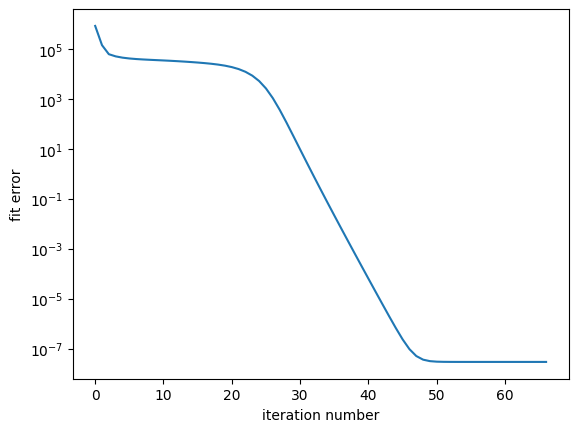

Introduction to BTD with pyBBTD
===================================

This tutorial provides an introduction to Block Tensor Decomposition (BTD) using the pyBBTD library.

Load required libraries
------------------------

.. code:: python3

    import pybbtd.btd as btd
    from pybbtd.solvers import btd_als
    import numpy as np
    import matplotlib.pyplot as plt
    
Generate noisy data with known BTD structure and fit a BTD model
-------------------------------------------------------------------------------------

We first define the dimensions of the tensor and the BTD parameters.

.. code:: python3

    I, J, K = 80, 100, 4  # dimensions of the tensor
    R = 3                 # number of BTD terms
    L = 5                 # rank of each term

    # Define the BTD model
    X = btd.BTD([I, J, K], R, L, block_mode="LL1")

Then we create the true BTD components and generate the observed tensor with added noise.

.. code:: python3

    # Generate ground truth BTD factors
    A0, B0, C0 = btd_als.init_BTD_factors(X, strat="random")

    # Generate the observed tensor with noise
    theta = X.get_constraint_matrix()  # CP equivalent constraint matrix
    X_observed = btd.factors_to_tensor(A0, B0, C0, theta, block_mode="LL1") + 1 * 1e-10 * np.random.randn(*X.dims)

We now fit a BTD model to the observed tensor.

.. code:: python3

   # Fit the model using random initialization
    X.fit(T_observed, max_iter=3000, init="random", rel_tol=1e-9, abs_tol=1e-15)

    # Save the fit error for comparison with SVD init
    rand_init_fit_error = X.fit_error

    # Retrieve the estimated factors if necessary
    A_est, B_est, C_est = X.factors

    # Check convergence curve
    fig, ax = plt.subplots()
    ax.semilogy(X.fit_error)
    ax.set_ylabel("fit error")
    _ = ax.set_xlabel("iteration number")

