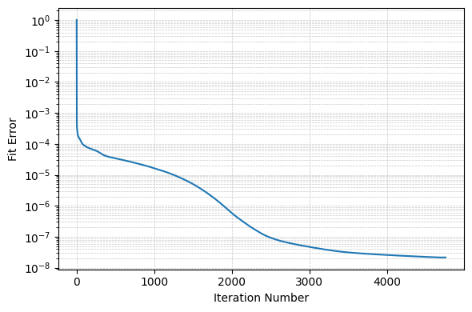

Cov-LL1 tutorial with pyBBTD
===================================

This tutorial provides an introduction on how to use Cov-LL1 for covariance imaging applications using the pyBBTD library.

Load required libraries
------------------------

.. code:: python3

    import numpy as np
    import pybbtd.covll1 as covll1
    import pybbtd as pybbtd
    from pybbtd.visualization import draw_metrics
    
Generate Cov-LL1 data
-------------------------------------------------------------------------------------

We first define the dimensions of the tensor and create a Cov-LL1 model instance.

.. code:: python3

    R = 2
    L1 = 5
    L2 = 2 # Note here that Cov-LL1 cannot handle rank-constraints for the covariance data, so in this example, this is a parameter used only to generate data.

    # Define spatial dimensions N1 and N2, and covariance dimension (N3 x N3), which gives N3^2 for Cov-LL1
    N1, N2, N3 = 20, 20, 2
    dims = (N1, N2, N3**2)

    X = covll1.CovLL1(dims, R=R, L1=L1, L2=L2, block_mode="LL1")

Then we create the true Cov-LL1 components and generate the observed tensor with added noise.

.. code:: python3

    # Create ground truth tensor
    [A0, B0, C0], T0 = X.generate_covll1_tensor()
    Tnoisy = T0 + 1 * 1e-6 * np.random.randn(*X.dims)

    # We check if all pixels carry valid covariance matrices
    covll1.validate_cov_matrices(Tnoisy)

We now fit a Cov-LL1 model to the observed tensor with k-means initialization

.. code:: python3

    X.fit(data=Tnoisy, algorithm="ADMM", init="kmeans", max_iter=10000, rho=1, max_admm=50, rel_tol=10**-6, abs_tol=10**-12, admm_tol=10**-8)

    # Plot the fit error curve
    draw_metrics.plot_error(X.fit_error)
 
